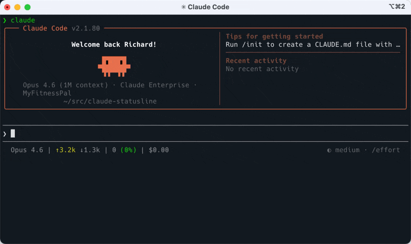

# claude-statusline

A compact status bar for [Claude Code](https://claude.ai/code) that shows per-round token usage, context health, and session cost.



```
Opus 4.6 | ↑1.2k ↓354 | 53.4k (7%) | $2.50
```

## What it shows

- **Model name** - shortened (e.g., "Opus 4.6")
- **↑ input / ↓ output** - tokens used this round, growing monotonically as Claude works
- **Context tokens (%)** - total context window size with color-coded percentage
- **Session cost** - cumulative USD spend
- **Location** - agent name, worktree, or directory (only shown when it differs from the project root)

## Color coding

| Indicator | Green | Yellow | Red |
|-----------|-------|--------|-----|
| Context % | < 50% | 50-79% | 80%+ |
| Round input (↑) | < 5k tokens | 5-20k tokens | > 20k tokens |

Context % tells you when you're running out of room. Round input helps you learn which prompts are expensive.

## Requirements

- [jq](https://jqlang.github.io/jq/) (`brew install jq`)
- Claude Code v2.1+

## Install

```bash
git clone https://github.com/myfitnesspal/claude-statusline.git ~/.claude-statusline
cd ~/.claude-statusline
./install.sh
```

The install script symlinks `statusline.sh` to `~/.claude/statusline.sh` and prints the settings.json snippet to add.

### Per-round tracking (optional)

To track tokens per round (resetting ↑/↓ with each prompt), add the `UserPromptSubmit` hook to `~/.claude/settings.json`:

```json
{
  "hooks": {
    "UserPromptSubmit": [
      {
        "hooks": [
          {
            "type": "command",
            "command": "~/.claude-statusline/round-reset.sh"
          }
        ]
      }
    ]
  }
}
```

Without this hook, ↑/↓ accumulate across the entire session.

## Manual install

1. Copy `statusline.sh` to `~/.claude/statusline.sh`
2. Make it executable: `chmod +x ~/.claude/statusline.sh`
3. Add to `~/.claude/settings.json`:

```json
{
  "statusLine": {
    "type": "command",
    "command": "bash ~/.claude/statusline.sh"
  }
}
```

## Customization

Edit the color variables at the top of `statusline.sh`:

```bash
GREEN='\033[32m'        # context/prompt OK
YELLOW='\033[33m'       # context/prompt warning
RED='\033[31m'          # context/prompt critical
NORMAL='\033[38;5;245m' # labels and default text
```

Adjust thresholds in the `if` blocks to match your preferences.

## How it works

Claude Code pipes a JSON object with session data to the statusline script via stdin after each assistant message. The script extracts fields with `jq` and prints formatted output.

Per-round tracking works by using a `UserPromptSubmit` hook that writes a reset marker. The statusline accumulates `cache_creation_input_tokens + input_tokens` (fresh tokens per API call) and `output_tokens` within each round, giving a monotonically growing count that resets with each new prompt.

See the [statusline docs](https://code.claude.com/docs/en/statusline) for all available fields.

## License

MIT
