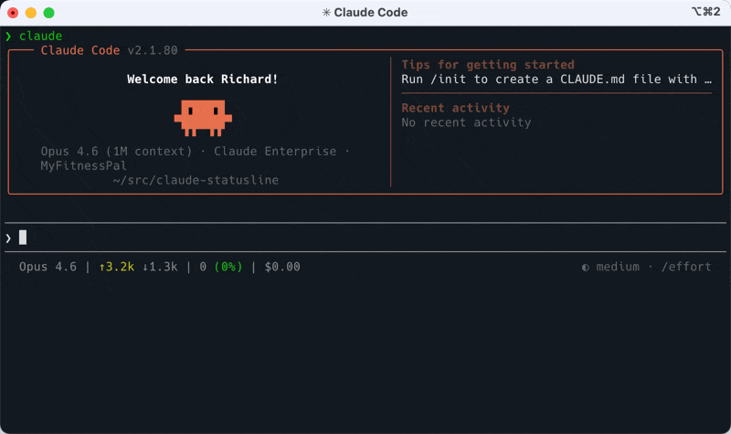

# claude-statusline

A compact status bar for [Claude Code](https://claude.ai/code) that shows model, context health, rate-limit usage, and session cost on one line.



```
O4.6 1M M | 130k ███░░░░░ | 1h1m 12% · 3d5h 34% | 19m +$0.05 $2.50
```

Sections are separated by `|`. Fields hide themselves when they aren't actionable, so the line stays short.

## What it shows

Left to right:

- **Model + window** — abbreviated model name and context-window size (`Opus 4.6 (1M context)` → `O4.6 1M`; Opus→O, Sonnet→S, Haiku→H).
- **Auth / plan letter** — `K` (ANTHROPIC_API_KEY), `M` Max, `P` Pro, `T` Team, `E` Enterprise, `A` other. Hidden when logged out with no key.
- **Location** *(conditional)* — agent name, worktree, or directory basename; shown only when it differs from the project root.
- **Context** — total tokens plus a **usage bar**. The bar fills to the first ceiling that binds — the 400K retrieval quality line or the auto-compact threshold, whichever is smaller. Past 400K it pegs full and adds a `▶` arrowhead. Colored by absolute token count (see below).
- **Rate limits** *(when available)* — 5-hour and 7-day usage as `<time-to-reset> <percent>%`, separated by `·`. The 7-day limit is followed by a **bidirectional gas-pedal pace meter**: empty = on pace; it fills **left in red** when you're burning too fast (you'll hit the cap before the window resets) and **right in blue** when you're burning too slow (you'll leave weekly budget unused — it's lost at reset). It's time-aware: a steady off-pace burn stays calm early (still time to correct) and only fills as it gets urgent near the reset. Weekly budget doesn't roll over, so both directions matter.
- **Cost + timing** — total API request time, this round's spend (`+$`), and cumulative session cost.

## Color coding

Context is colored by **absolute token count** (retrieval quality degrades at fixed token thresholds regardless of window size), not by percentage:

| Section | Green | Yellow | Orange | Red |
|---------|-------|--------|--------|-----|
| Context tokens | < 120K | 120–250K | 250–400K | ≥ 400K |
| Rate limits | < 50% | 50–79% | — | ≥ 80% |

## Requirements

- [jq](https://jqlang.github.io/jq/) (`brew install jq`)
- Claude Code with statusline support

## Install

```bash
git clone https://github.com/myfitnesspal/claude-statusline.git ~/.claude-statusline
cd ~/.claude-statusline
./install.sh
```

`install.sh` symlinks `statusline.sh` to `~/.claude/statusline.sh` and prints the `statusLine` snippet to add to `~/.claude/settings.json`:

```json
{
  "statusLine": {
    "type": "command",
    "command": "bash ~/.claude/statusline.sh"
  }
}
```

### Per-round cost tracking (optional)

The `+$` field shows spend since your last prompt. To reset it on each prompt, add the `UserPromptSubmit` hook to `~/.claude/settings.json`:

```json
{
  "hooks": {
    "UserPromptSubmit": [
      {
        "hooks": [
          { "type": "command", "command": "~/.claude-statusline/round-reset.sh" }
        ]
      }
    ]
  }
}
```

Without this hook, `+$` accumulates across the whole session.

## Customization

Configure via environment variables. The cleanest place is the `env` block in `settings.json` (Claude Code injects it into the statusline subprocess — no shell-profile edits needed), scoped to whichever settings file fits (`~/.claude/settings.json` for all sessions, or a project's `.claude/settings.local.json`):

```json
{
  "env": { "STATUSLINE_PACE_WORK": "Mon-Fri 09-18" }
}
```

| Variable | Default | Effect |
|----------|---------|--------|
| `STATUSLINE_CTX_BAR_WIDTH` | 8 | Cells in the context usage bar. |
| `STATUSLINE_PACE_BAR_WIDTH` | 8 | Cells in the 7-day pace meter. |
| `STATUSLINE_PACE_TOL` | 10 | Pace-meter dead-band (percent of urgency); inside it the meter reads empty/on-pace. |
| `STATUSLINE_PACE_GAMMA` | 1.5 | Pace-meter response curve: `1` linear, higher keeps it flatter/calmer until urgent. |
| `STATUSLINE_PACE_WORK` | — | Your work schedule `"<days> <start>-<end>"` local (e.g. `"Mon-Fri 09-18"`; days a range or comma list, hours 24h). The pace meter then judges "will I run dry in time?" against the last work moment before the reset instead of the reset itself — useful for a work account you only run on a schedule. It still warns if you'd run dry during work, but stops penalizing you for off-hours you won't use; and it stays correct even when the reset drifts mid-week (a reset during work hours just judges to the reset). |
| `STATUSLINE_COMPACT_OVERHEAD` | 33000 | Tokens subtracted from the window to approximate the auto-compact threshold. |
| `CLAUDE_AUTOCOMPACT_PCT_OVERRIDE` | — | Claude Code's own variable (not namespaced, on purpose): if set (e.g. `75`), treats auto-compact as that percent of the window; wins over `STATUSLINE_COMPACT_OVERHEAD`. The statusline reads the same var Claude Code does. |

Colors and thresholds live at the top of `statusline.sh`:

```bash
GREEN='\033[32m'
YELLOW='\033[33m'
ORANGE='\033[38;5;208m'
RED='\033[31m'
NORMAL='\033[38;5;245m'
```

## How it works

Claude Code pipes a JSON object with session data to the script on stdin each time the statusline refreshes. The script extracts fields with a single `jq` call and prints one formatted line. Per-round cost tracking uses a `UserPromptSubmit` hook (`round-reset.sh`) that drops a marker file; the statusline resets its round baseline when it sees it.

See `SPEC.md` for the full layout, color rationale, and threshold derivations, and the [statusline docs](https://code.claude.com/docs/en/statusline) for all available JSON fields.

## License

MIT
